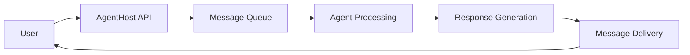

# Messages and Limits

Understanding AgentHost's messaging system and platform limits is crucial for building reliable, scalable agents. This guide covers message handling, rate limits, usage quotas, and best practices for optimal performance.

## Message System Overview

AgentHost's messaging system handles all communication between users and your agents, providing reliable delivery, message persistence, and real-time capabilities.

### Message Flow



### Message Types

<Tabs>
  <Tab title="Text Messages">
    Standard text-based conversations:
    
    ```json
    {
      "type": "text",
      "content": "Hello, I need help with my order",
      "timestamp": "2024-01-15T10:30:00Z",
      "user_id": "user_123",
      "session_id": "session_abc"
    }
    ```
  </Tab>
  
  <Tab title="Media Messages">
    Messages containing files or media:
    
    ```json
    {
      "type": "media",
      "content": "Here's the error screenshot",
      "media": {
        "type": "image",
        "url": "https://cdn.agenthost.ai/uploads/screenshot.png",
        "size": 2048576,
        "mime_type": "image/png"
      }
    }
    ```
  </Tab>
  
  <Tab title="System Messages">
    Internal system communications:
    
    ```json
    {
      "type": "system",
      "event": "session_started",
      "metadata": {
        "user_agent": "Mozilla/5.0...",
        "ip_address": "192.168.1.1",
        "referrer": "https://example.com"
      }
    }
    ```
  </Tab>
</Tabs>

## Rate Limits

Rate limits protect the platform and ensure fair usage across all users. AgentHost implements multiple types of rate limiting:

### Per-Agent Limits

<AccordionGroup>
  <Accordion icon="clock" title="Messages per Minute">
    **Free Tier**: 20 messages/minute
    **Pro Tier**: 100 messages/minute
    **Enterprise**: 1000+ messages/minute (configurable)
    
    ```json Rate Limit Headers
    {
      "X-RateLimit-Limit": "100",
      "X-RateLimit-Remaining": "95",
      "X-RateLimit-Reset": "1640995200"
    }
    ```
  </Accordion>
  
  <Accordion icon="calendar" title="Messages per Day">
    **Free Tier**: 1,000 messages/day
    **Pro Tier**: 10,000 messages/day
    **Enterprise**: Unlimited
    
    Resets daily at 00:00 UTC
  </Accordion>
  
  <Accordion icon="users" title="Concurrent Conversations">
    **Free Tier**: 10 concurrent conversations
    **Pro Tier**: 100 concurrent conversations
    **Enterprise**: 1000+ concurrent conversations
    
    Automatically scales based on demand
  </Accordion>
</AccordionGroup>

### Per-User Limits

Individual users interacting with your agent are also subject to limits:

<ResponseField name="messages_per_session" type="number" default="50">
  Maximum messages a single user can send in one session.
  
  **Range**: 10-500 messages
</ResponseField>

<ResponseField name="session_duration" type="number" default="3600">
  Maximum session duration in seconds before automatic timeout.
  
  **Range**: 300-86400 seconds (5 minutes to 24 hours)
</ResponseField>

<ResponseField name="cooldown_period" type="number" default="60">
  Required wait time between sessions for the same user.
  
  **Range**: 0-3600 seconds
</ResponseField>

### API Rate Limits

When using AgentHost APIs programmatically:

<CardGroup cols={2}>
  <Card title="REST API" icon="cloud">
    - **Authentication**: 5 requests/second
    - **Message Sending**: 20 requests/second
    - **Data Retrieval**: 50 requests/second
    - **File Uploads**: 2 requests/second
  </Card>
  <Card title="WebSocket API" icon="wifi">
    - **Connection Limit**: 100 concurrent connections
    - **Message Rate**: 10 messages/second per connection
    - **Heartbeat**: Every 30 seconds
    - **Reconnection**: 3 attempts with exponential backoff
  </Card>
</CardGroup>

## Usage Quotas

### Token Consumption

AI model usage is measured in tokens. Understanding token consumption helps manage costs:

<Tabs>
  <Tab title="GPT-4 Turbo">
    **Input**: $0.01 per 1K tokens
    **Output**: $0.03 per 1K tokens
    
    **Average tokens per message**:
    - Simple question: 50-100 tokens
    - Detailed explanation: 200-500 tokens
    - Complex analysis: 500-1500 tokens
  </Tab>
  
  <Tab title="GPT-3.5 Turbo">
    **Input**: $0.001 per 1K tokens
    **Output**: $0.002 per 1K tokens
    
    **Average tokens per message**:
    - Simple question: 40-80 tokens
    - Detailed explanation: 150-400 tokens
    - Complex analysis: 400-1000 tokens
  </Tab>
  
  <Tab title="Claude 3">
    **Input**: $0.008 per 1K tokens
    **Output**: $0.024 per 1K tokens
    
    **Average tokens per message**:
    - Simple question: 45-90 tokens
    - Detailed explanation: 180-450 tokens
    - Complex analysis: 450-1200 tokens
  </Tab>
</Tabs>

### Storage Limits

<AccordionGroup>
  <Accordion icon="database" title="Message History">
    **Free Tier**: 30 days of message history
    **Pro Tier**: 1 year of message history
    **Enterprise**: Unlimited retention
    
    Automatic archiving and compression for older messages
  </Accordion>
  
  <Accordion icon="file" title="File Storage">
    **Free Tier**: 1 GB total storage
    **Pro Tier**: 10 GB total storage
    **Enterprise**: 100 GB+ storage
    
    **File size limits**:
    - Images: 10 MB max
    - Documents: 25 MB max
    - Audio: 50 MB max
    - Video: 100 MB max
  </Accordion>
  
  <Accordion icon="brain" title="Knowledge Base">
    **Free Tier**: 100 documents
    **Pro Tier**: 1,000 documents
    **Enterprise**: 10,000+ documents
    
    Total size limits apply in addition to document count
  </Accordion>
</AccordionGroup>

## Performance Limits

### Response Time Limits

<ResponseField name="response_timeout" type="number" default="30">
  Maximum time in seconds for agent to respond before timeout.
  
  **Recommended**: 10-30 seconds for good user experience
</ResponseField>

<ResponseField name="processing_timeout" type="number" default="60">
  Maximum time for complex operations like file analysis.
  
  **Range**: 30-300 seconds depending on operation
</ResponseField>

### Context Window Limits

Different models have varying context window sizes:

```json Context Limits
{
  "gpt-4-turbo": {
    "max_tokens": 128000,
    "recommended_conversation_length": 50
  },
  "gpt-3.5-turbo": {
    "max_tokens": 16385,
    "recommended_conversation_length": 20
  },
  "claude-3-sonnet": {
    "max_tokens": 200000,
    "recommended_conversation_length": 80
  }
}
```

<Warning>
**Context Window Management**: When conversations exceed the context window, older messages are automatically truncated. Important context should be summarized and retained.
</Warning>

## Monitoring and Alerts

### Usage Monitoring

Track your usage through the AgentHost dashboard:

<CardGroup cols={2}>
  <Card title="Real-time Metrics" icon="chart-line">
    - Current rate limit usage
    - Active conversations
    - Response times
    - Error rates
  </Card>
  <Card title="Historical Analytics" icon="clock">
    - Daily/weekly/monthly usage trends
    - Peak usage periods
    - Cost analysis
    - Performance benchmarks
  </Card>
</CardGroup>

### Alert Configuration

Set up alerts to monitor limits:

```json Alert Configuration
{
  "alerts": {
    "rate_limit_80_percent": {
      "enabled": true,
      "notification": ["email", "webhook"],
      "threshold": 0.8
    },
    "daily_quota_90_percent": {
      "enabled": true,
      "notification": ["email", "slack"],
      "threshold": 0.9
    },
    "response_time_degradation": {
      "enabled": true,
      "threshold": "5s",
      "duration": "5m"
    }
  }
}
```

## Handling Limit Exceeding

### Graceful Degradation

When limits are approached or exceeded:

<Tabs>
  <Tab title="Rate Limit Exceeded">
    ```json HTTP 429 Response
    {
      "error": "rate_limit_exceeded",
      "message": "Too many requests. Please wait before sending more messages.",
      "retry_after": 60,
      "quota_reset": "2024-01-15T11:00:00Z"
    }
    ```
    
    **Best practices**:
    - Implement exponential backoff
    - Queue messages for later delivery
    - Show user-friendly wait messages
  </Tab>
  
  <Tab title="Quota Exceeded">
    ```json HTTP 402 Response
    {
      "error": "quota_exceeded",
      "message": "Monthly quota exceeded. Please upgrade your plan.",
      "current_usage": 10000,
      "quota_limit": 10000,
      "reset_date": "2024-02-01T00:00:00Z"
    }
    ```
    
    **Options**:
    - Upgrade plan automatically
    - Purchase additional quota
    - Wait for quota reset
  </Tab>
  
  <Tab title="Timeout Handling">
    ```json Timeout Response
    {
      "error": "timeout",
      "message": "Agent response took too long. Please try again.",
      "timeout_duration": 30,
      "suggestion": "Try breaking down complex requests"
    }
    ```
    
    **Recovery strategies**:
    - Retry with simplified request
    - Break complex queries into parts
    - Offer alternative assistance
  </Tab>
</Tabs>

## Optimization Strategies

### Reducing Token Usage

<AccordionGroup>
  <Accordion icon="compress" title="Prompt Optimization">
    - Use clear, concise system prompts
    - Avoid redundant instructions
    - Implement prompt templates
    - Regular prompt auditing
  </Accordion>
  
  <Accordion icon="scissors" title="Context Management">
    - Summarize long conversations
    - Remove unnecessary context
    - Implement smart context pruning
    - Use conversation checkpoints
  </Accordion>
  
  <Accordion icon="cache" title="Response Caching">
    - Cache common responses
    - Implement semantic similarity matching
    - Use template responses for FAQs
    - Cache expensive computations
  </Accordion>
</AccordionGroup>

### Improving Performance

<CardGroup cols={2}>
  <Card title="Message Batching" icon="layer-group">
    Group multiple messages to reduce API calls
    - Batch similar requests
    - Implement message queuing
    - Use bulk processing APIs
  </Card>
  <Card title="Async Processing" icon="clock">
    Handle long-running tasks asynchronously
    - Background file processing
    - Deferred complex analysis
    - Progressive response delivery
  </Card>
  <Card title="Load Balancing" icon="scale-balanced">
    Distribute load across multiple agents
    - Regional agent deployment
    - Smart routing algorithms
    - Automatic failover
  </Card>
  <Card title="Compression" icon="file-zipper">
    Reduce bandwidth usage
    - Message compression
    - Image optimization
    - Efficient encoding
  </Card>
</CardGroup>

## Enterprise Features

For high-volume applications, enterprise features provide additional capabilities:

### Custom Limits

```json Enterprise Configuration
{
  "custom_limits": {
    "messages_per_minute": 5000,
    "concurrent_conversations": 10000,
    "custom_rate_limiting": true,
    "priority_queue": true,
    "dedicated_infrastructure": true
  }
}
```

### SLA Guarantees

<ResponseField name="uptime_sla" type="string" default="99.9%">
  Guaranteed uptime with financial penalties for breaches
</ResponseField>

<ResponseField name="response_time_sla" type="string" default="500ms">
  Guaranteed maximum response time for 95th percentile
</ResponseField>

<ResponseField name="support_sla" type="string" default="24/7">
  Priority support with guaranteed response times
</ResponseField>

## Best Practices

<Tip>
**Monitor Proactively**: Set up alerts at 80% of limits to avoid service disruption.
</Tip>

<Warning>
**Plan for Growth**: Design your application to handle limit increases gracefully as you scale.
</Warning>

<Note>
**Test Limits**: Regularly test your application's behavior when limits are reached.
</Note>

### Implementation Examples

<CodeGroup>
```javascript Rate Limit Handling
async function sendMessage(message) {
  try {
    const response = await agentHost.send(message);
    return response;
  } catch (error) {
    if (error.status === 429) {
      const retryAfter = error.headers['retry-after'];
      await sleep(retryAfter * 1000);
      return sendMessage(message); // Retry
    }
    throw error;
  }
}
```

```python Quota Management
def check_quota_usage():
    usage = agent_host.get_usage()
    if usage.percentage > 0.8:
        send_alert("Approaching quota limit")
    if usage.percentage > 0.95:
        implement_rate_limiting()
```

```curl API Example
curl -H "Authorization: Bearer YOUR_API_KEY" \
     -H "Content-Type: application/json" \
     -d '{"message": "Hello"}' \
     https://api.agenthost.ai/v1/agents/YOUR_AGENT_ID/messages
```
</CodeGroup>

## Next Steps

<CardGroup cols={2}>
  <Card
    title="Uploading Agent Files"
    icon="upload"
    href="/agenthost/uploading-agent-files"
  >
    Learn how to manage files and documents for your agents
  </Card>
  <Card
    title="Monetizing Agents"
    icon="dollar-sign"
    href="/agenthost/monetizing-agents"
  >
    Explore options for generating revenue from your agents
  </Card>
</CardGroup>